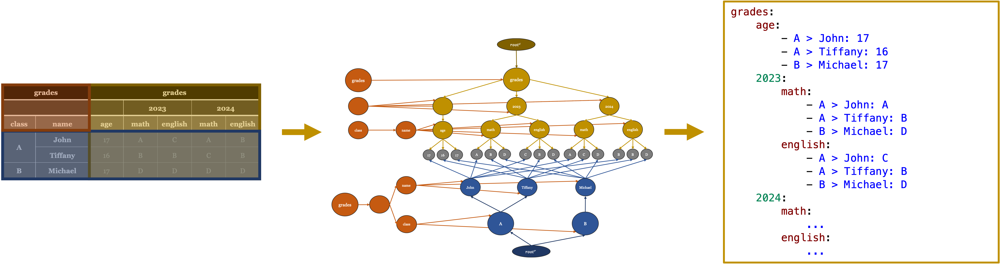
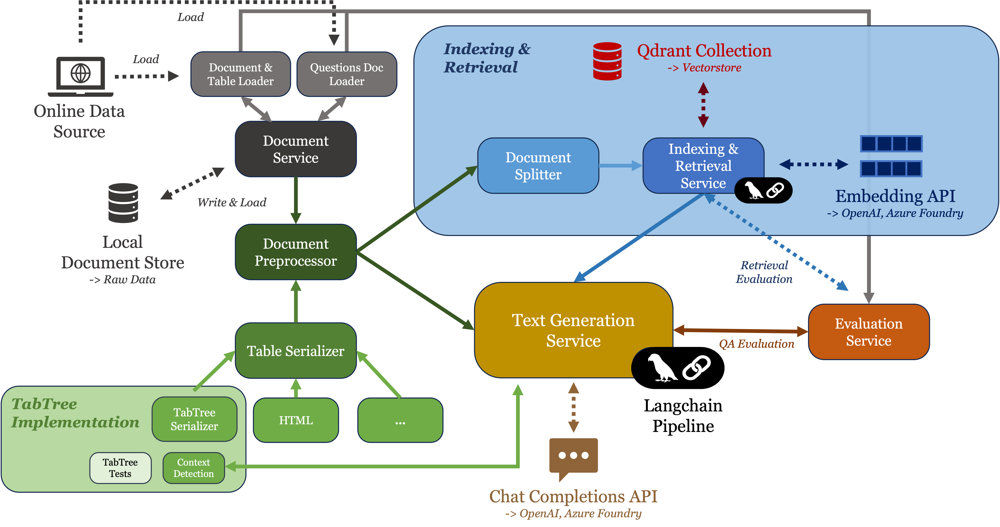

# Exploring Table Representations for Question Answering

[](https://www.overleaf.com/read/mqphwrjjhytz#5746a7)

|  |
| :----------------------------------------------: |
|            Figure 1: Tab Tree Overview            |


### Introduction


This project explores **Table Question Answering (Table QA)** in open-domain settings, i.e., containing both text and tables. It introduces:

- **TabTree Serialization Model**: A table serialization method that models tables as directed tree structures.
- **RAG Framework**: Retrieval Augmented Generation framework tailored for the Table QA task on full documents, incorporating table-aware mechanisms.
- **Evaluation Dataset for Table QA on Large Documents**: A manually labeled evaluation dataset on financial data to benchmark the effectiveness of table representations and retrieval strategies. 

The goal is to assess how table representations affect LLM performance in both **standalone Table QA** and **document-level QA**.
  

### Research Questions  

The thesis addresses the following core research questions:  
- How well do LLMs perform in Table QA on large documents with integrated text and tables?  
- Which table representation yields the best quality in Table QA?  
  - How does table representation affect retrieval effectiveness in a RAG pipeline?  
  - How does it influence the generative QA process of LLMs?  
- Which components of a RAG pipeline are most critical for generating accurate responses with respect to tabular data?

### Implementation Overview

|  |
| :----------------------------------------------: |
|            Figure 2: Implementation Overview           |

The framework is built around a RAG pipeline with the following components:

- **TabTree Serialization**: A table representation using tree structures to preserve tabular semantics.
- **Preprocessing & Serialization**: Documents are parsed with BeautifulSoup. Tables are serialized using Pandas for baselines and a custom approach for TabTree.
- **Indexing & Retrieval**: Documents are semantically chunked, embedded using OpenAI's `text-embedding-3-small`, and stored in a Qdrant vector store. Retrieval is done via a vanilla dense approach employing cosine similarity.
- **Text Generation**: LLMs are used via Langchain with prompt templates tailored to each task. Supported models include `GPT-4o`, `GPT-4o-mini`, `Llama 3.3 70B`, and `Phi-4`.
- **Evaluation Metrics**:
  - **Retrieval**: Recall@k and MRR@k (binary retrieval setting).
  - **QA Tasks**: Execution Accuracy and Macro-F1 Score (via standardized answer parsing).

### Results

#### Vanilla Table QA (WikiTableQuestions)
- **Top-performing LLM**: `GPT-4o` — up to **0.76** execution accuracy.
- **Best table format**: `HTML` serialization consistently outperformed CSV, Markdown, and JSON.
- **TabTree**:
   - Lower overall accuracy than baselines and increased token count.
   - Performing well on position-related questions
   - Best config: *Text-Augmentation with Context Intersection* reached **0.62** accuracy.

#### Chunk Retrieval (SEC-Filing Tables)
- **Best performing format**: `TabTree-Base` with MRR@5 = **0.46** and Recall@5 = **0.74**.
- **Baseline performance**: Markdown and JSON formats also performed well (MRR@5 ~ 0.35–0.39).
- **Context Augmentation** (including preceding sentences of tables for indexing):
   - Improves TabTree variants.
   - Slightly reduces performance for HTML/CSV baselines.
- **Table Summarization**: Compact and effective, but requires additional LLM calls per table.

#### Table QA on Full Documents
- **Best end-to-end performance**: `TabTree-Base` + related tables in HTML → Execution Accuracy = **0.55** (GPT-4o-mini).
- **Baselines**:
  - `HTML` and `Markdown` reached up to **0.47**.
- **Including Related Tables**:
  - Slight boost in accuracy but yields potentially context window overflow, especially when using smaller models.
- **Retrieval is the Bottleneck**:
  - If retrieval succeeds, LLMs often produce correct answers.
  - Execution accuracy closely aligns with Recall@3 across all tasks.

Corresponding analysis of the evaluation results can be found in the `analysis` folder. The analysis is divided into the following sections:
- [**Context / Header Detection**](analysis/context_detection_analysis.ipynb)
- [**SEC-Filing Tables Analysis**](analysis/sec_filing_tables_analysis.ipynb)
- [**WikiTableQuestions Analysis**](analysis/wikitables_question_analysis.ipynb)
- [**Vanilla Table QA**](analysis/table_qa_only_analysis.ipynb)
- [**Chunk Retrieval**](analysis/retrieval_analysis.ipynb)
- [**Table QA on Full Documents**](analysis/qa_full_documents_analysis.ipynb)

## Getting Started

### Prerequisites

Before starting, ensure you have the following installed:

- [Conda](https://docs.conda.io/projects/conda/en/latest/user-guide/install/index.html)
- [Python 3.12](https://www.python.org/)

### Environment Setup

1. Clone the repository:
   ```bash
   git clone <repository_url>
   cd <repository_folder>
   ```

2. Create the Conda environment:
   ```bash
   conda env create -f environment.yml
   ```

3. Activate the environment:
   ```bash
   conda activate rag-project
   ```

   You might change the name of the environment in the `environment.yml` file if needed.

5. **Set up environment variables**:  
   Create a `.env` file in the root directory by copying the contents of `.env.example`. The `.env` file contains sensitive information like API keys and environment-specific configurations. Ensure that your environment variables are correctly set before running the project. 
   
---

### Running the Code

Before running any code, you need to set up Ollama and Qdrant as services using Docker Compose.

1. **Set up Qdrant**:  
   The `compose.yml` file sets up Qdrant (for vector storage). Make sure these services are running before executing code related to indexing and retrieval tasks. You can start the services with the following command:

   ```bash
   docker-compose -f compose.yml up -d
   ```

2. **Run Code**: 
   We provide different configuration files for the different evaluated tasks of the thesis, i.e. Context / Header Detection, Document / Dataset Analysis, Vanilla Table QA, Chunk Retrieval, and Table QA on Full Documents. For detailed information refer to the documentation within the thesis.

   To simply index the two evaluation documents of the SEC Filing data, i.e., `data/sec_filings/awk-20231231.htm` and `data/sec_filings/uber-20231231.htm` and run a chat interface using HTML table serialization, you can use the default configuration and run the following command:

   ```bash
   python -m src
   ```

   **Note:** Each paramater in the configuration files can be overwritten by passing it as a command line argument.

   To run the code for the different evaluated tasks, you can run one of the predefined configuration within the `config` folder. The following tasks are available:

   - **Context / Header Detection**:  
     ```bash
     python -m src --config-path ./configs/context_detection/context_detection.toml
     ```

   - **Document / Dataset Analysis**: 
      - **SEC-Filing Dataset**:  
        ```bash
        python -m src --config-path ./configs/document_analysis/sec_filings.toml
        ``` 
      - **WikiTableQuestions Dataset**:  
        ```bash
        python -m src --config-path ./configs/document_analysis/wikitablequestions.toml
        ```

   - **Vanilla Table QA (using WikiTableQuestions Dataset)**:
      - **Baselines (HTML, CSV, JSON, Markdown)**
       ```bash
       python -m src --config-path ./configs/qa_only/baselines.toml
       ```
      - **TabTree Primary Subtree Selection**:  
        ```bash
        python -m src --config-path ./configs/qa_only/tabtree_primary_subtree.toml
        ```
      - **TabTree**:  
        ```bash
        python -m src --config-path ./configs/qa_only/tabtree.toml
        ```
   - **Chunk Retrieval**:
      - **Baselines (HTML, CSV, JSON, Markdown)**:  
        ```bash
        python -m src --config-path ./configs/retrieval/baselines.toml
        ```
      - **TabTree Primary Subtree Selection**:  
        ```bash
        python -m src --config-path ./configs/retrieval/tabtree_primary_subtree.toml
        ```
      - **TabTree**:  
        ```bash
        python -m src --config-path ./configs/retrieval/tabtree.toml
        ```
      - **Table Summaries**:  
        ```bash
        python -m src --config-path ./configs/retrieval/table_summary.toml
        ```
   - **Table QA on Full Documents**:
      - **Baselines (HTML, CSV, JSON, Markdown)**:  
        ```bash
        python -m src --config-path ./configs/full_qa/baselines.toml
        ```
      - **TabTree**:  
        ```bash
        python -m src --config-path ./configs/full_qa/tabtree.toml
        ```
      - **Table Summaries**:  
        ```bash
        python -m src --config-path ./configs/full_qa/table_summary.toml
        ```


3. **Run Tests for the TabTree Model**
   If you want to run the tests for the TabTree model, you can do so by running the following command, when you are in the root directory of the project:

   ```bash
   python -m unittest discover -s src/tests -p "*test.py" -t .
   ```


