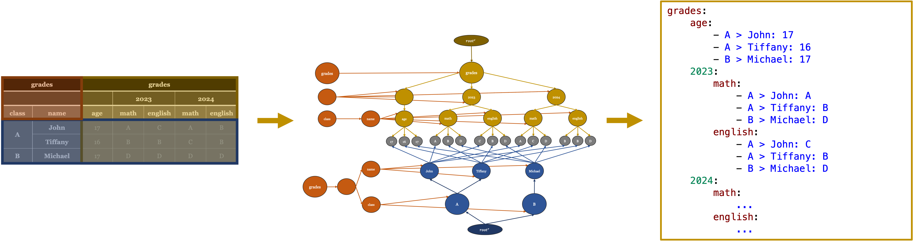

# Exploring Table Representations for RAG on Large Documents

[](https://www.overleaf.com/read/mqphwrjjhytz#5746a7)

|  |
| :----------------------------------------------: |
|            Figure 1: Tab Tree Overview            |

### Introduction / Motivation

This repository explores the capabilities of LLMs for Table QA in documents containing both text and tables. While LLMs have revolutionized tasks involving unstructured text, their architecture — rooted in the transformer model — is primarily designed for sequential data, making it less suited to the inherently two-dimensional structure of tabular data. Existing research highlights the limitations of LLMs in handling tabular heterogeneity, data sparsity, and correlations, leaving room for improvement in tasks like Table QA, particularly when tables are embedded in complex documents.    

This project aims to bridge these gaps by introducing a framework for Table QA on large documents (incorporating tables and text), with the following core components:  
- **TabTree Serialization Model**: A new table serialization method that models tables as directed tree structures.
- **RAG Framework**: Retrieval Augmented Generation framework tailored for the specific Table QA task on large documents, incorporating multiple table-aware mechanisms.
- **Evaluation Dataset for Table QA on Large Documents**: A manually labeled evaluation dataset to benchmark the effectiveness of table representations and retrieval strategies.  

### Research Questions  

The thesis addresses the following core research questions:  
- How well do LLMs perform in Table QA on large documents with integrated text and tables?  
- Which table representation yields the best quality in Table QA?  
  - How does table representation affect retrieval effectiveness in a RAG pipeline?  
  - How does it influence the generative QA process of LLMs?  
- Which components of a RAG pipeline are most critical for generating accurate responses? 

### Getting Started

#### Prerequisites

Before starting, ensure you have the following installed:

- [Conda](https://docs.conda.io/projects/conda/en/latest/user-guide/install/index.html)
- [Python 3.12](https://www.python.org/)

#### Environment Setup

1. Clone the repository:
   ```bash
   git clone <repository_url>
   cd <repository_folder>
   ```

2. Create the Conda environment:
   ```bash
   conda env create -f environment.yml
   ```

3. Activate the environment:
   ```bash
   conda activate rag-project
   ```

   You might change the name of the environment in the `environment.yml` file if needed.

5. **Set up environment variables**:  
   Create a `.env` file in the root directory by copying the contents of `.env.example`. The `.env` file contains sensitive information like API keys and environment-specific configurations. Ensure that your environment variables are correctly set before running the project. 
   
---

#### Running the Code

Before running any code, you need to set up Ollama and Qdrant as services using Docker Compose.

1. **Set up Ollama and Qdrant**:  
   The `compose.yml` file sets up Ollama (for LLM inference) and Qdrant (for vector storage). Make sure these services are running before executing any code. You can start the services with the following command:

   ```bash
   docker-compose -f compose.yml up -d
   ```

2. Once the services are running, you can run the project with different modes by using the appropriate command-line arguments. Below are the available configurations:

##### 1. **Run Pipeline**
   Executes the pipeline logic:
   ```bash
   python -m src --run.pipeline=true --run.indexing=false
   ```

##### 2. **Run Indexing**
   Runs the indexing logic:
   ```bash
   python -m src --run.indexing=true --run.pipeline=false
   ```

##### 3. **Run Analysis**
   Executes the analysis mode:
   ```bash
   python -m src --run.indexing=false --run.pipeline=false --run.analysis=true
   ```

##### 4. **Run Evaluation**
   Runs the evaluation logic:
   ```bash
   python -m src --run.indexing=false --run.pipeline=false --run.evaluation=true
   ```

##### 5. **Run Eval Multi**
   Executes evaluation in multi-mode:
   ```bash
   python -m src --run.pipeline=false --run.evaluation-multi=true
   ```

#### 6. **Run Tests for the TabTree Model**
   Runs the tests for the TabTree model:
   ```bash
   python -m unittest discover -s src/tests -p tabtree_model_test.py -t .
   ```

---

##### Deleting All Qdrant Collections

To delete all collections in Qdrant (if needed), you can run the following command:

```bash
QDRANT_URL="http://localhost:6333"; curl -s "$QDRANT_URL/collections" | jq -r '.result.collections[].name' | xargs -I {} curl -X DELETE "$QDRANT_URL/collections/{}"
```

---

